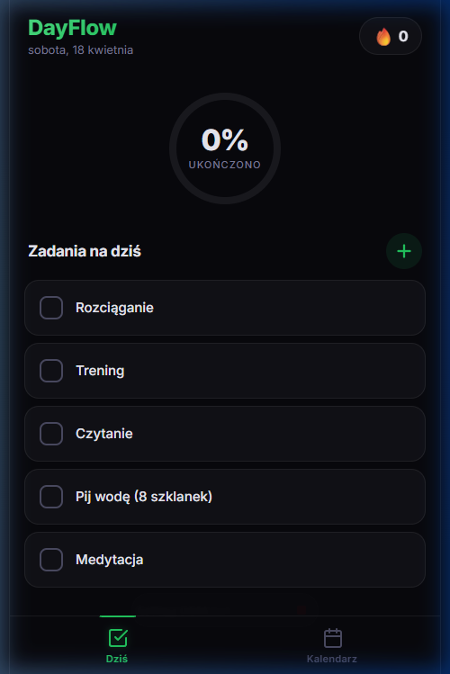

# DayFlow — Codzienny Tracker Zadań 🎯

Elegancka aplikacja mobilna (PWA) do śledzenia codziennych nawyków z kalendarzem postępów.



## ✨ Funkcje

- 📋 **Lista zadań** — stałe, codzienne zadania z checkboxami
- 📊 **Pierścień postępu** — wizualny wskaźnik ukończenia
- 📅 **Kalendarz** — kolorowe podświetlenie ukończonych dni
- 📝 **Opisy** — dodaj notatki do zadań
- 📋 **Podzadania** — rozbij zadania na kroki (np. rozciąganie → poszczególne ćwiczenia)
- 🔥 **Streak** — licznik kolejnych dni z pełnym ukończeniem
- 🎉 **Celebracja** — konfetti po ukończeniu wszystkich zadań
- 🗓 **Harmonogram** — wybierz dni tygodnia lub powtarzaj co X dni
- 🎨 **7 motywów** — Midnight, Ocean, Zachód, Las, Lawenda, Sakura, Monokai
- 👆 **Swipe** — przesuwanie między zakładkami
- 💾 **Offline** — dane zapisywane lokalnie (localStorage)
- 📱 **PWA** — instalowalna na telefonie

## 🚀 Instalacja

### Na telefonie (bez APK)
1. Otwórz stronę w Chrome na Androidzie
2. Kliknij **⋮ → Dodaj do ekranu głównego**
3. Gotowe! Apka działa jak natywna

### Jako APK
1. Wejdź na [PWABuilder.com](https://www.pwabuilder.com/)
2. Wklej URL strony (np. `https://TWOJA_NAZWA.github.io/dayflow/`)
3. Kliknij **Start** → wybierz **Android** → **Download APK**
4. Zainstaluj APK na telefonie

### Lokalnie
Wystarczy otworzyć `index.html` w przeglądarce — nie wymaga serwera ani Node.js.

## 📁 Struktura

```
dayflow/
├── index.html      # Struktura HTML
├── style.css       # Style (ciemny motyw, animacje)
├── app.js          # Logika aplikacji
├── manifest.json   # Manifest PWA
├── sw.js           # Service Worker (offline)
├── icon.png        # Ikona aplikacji
└── README.md       # Ten plik
```

## 🎨 Motywy

| Motyw | Kolor |
|-------|-------|
| 🌙 Midnight | Szmaragd |
| 🌊 Ocean | Błękit |
| 🌅 Zachód | Pomarańcz |
| 🌲 Las | Limonka |
| 💜 Lawenda | Fiolet |
| 🌸 Sakura | Róż |
| ⚡ Monokai | Złoto |

## 📄 Licencja

MIT — rób z tym co chcesz!
